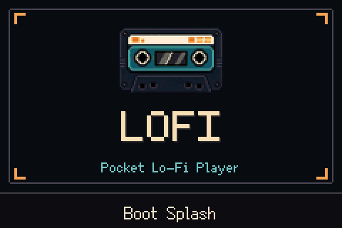

# Cardputer Adv Lo-Fi Player

[English](README.md) | [简体中文](README.zh-CN.md) | [日本語](README.ja.md)

Cardputer Adv Lo-Fi Player is a local music player firmware for M5Stack Cardputer Adv. Put music on a microSD card, browse and play it on the device, and switch between a few Lo-Fi sound presets.



## Status

Current version: `v0.1.0` beta.

Release flashing packages will be added later.

## Features

- Local music browsing and playback
- Queue, previous/next track, play/pause, progress, and volume controls
- Repeat and Shuffle
- Several Lo-Fi sound presets
- Playback state save and restore
- Supports `mp3`, `m4a`, `aac`, and `wav`

## Supported Hardware

Currently tested only on M5Stack Cardputer Adv. The regular Cardputer and other ESP32-S3 boards are not guaranteed to work yet.

## microSD Layout

Use a FAT32-formatted microSD card and place music under `/Music`.

Recommended layout:

```text
/Music/Artist/Album/Track.m4a
/Music/Artist/Track.mp3
/Music/Track.wav
```

The firmware stores its index and playback state here:

```text
/Music/LOFI/INDEX.TXT
/Music/LOFI/STATE.TXT
```

Delete these two files if you want to rescan music or reset playback state.

## Install

Release flashing packages are not available yet. For now, build and flash from source.

After a release is available, prefer the instructions on the release page.

## Build From Source

Install and enter the ESP-IDF environment first. This project uses ESP-IDF `v5.4.1`.

For a normal release-style firmware, build with the release defaults. This strips the serial automation hooks, framebuffer dump endpoint, machine-readable UI snapshots, self-test media commands, sample-library fallback, and verbose debug logs.

```bash
idf.py -B build-release \
  -DSDKCONFIG=build-release/sdkconfig \
  -DSDKCONFIG_DEFAULTS="sdkconfig.defaults;sdkconfig.release.defaults" \
  set-target esp32s3 build
idf.py -B build-release -p PORT flash monitor
```

Replace `PORT` with your actual serial port, such as `/dev/ttyUSB0`, `/dev/cu.usbmodemXXXX`, or `COM3`.

For development and hardware automation, build the debug firmware instead. This enables the debug serial controls, framebuffer screenshots, `AUTO SNAP` screen snapshots, `LOFI_STATUS` runtime lines, and WAV/MP3 self-test commands.

```bash
idf.py -B build-debug \
  -DSDKCONFIG=build-debug/sdkconfig \
  -DSDKCONFIG_DEFAULTS="sdkconfig.defaults;sdkconfig.debug.defaults" \
  set-target esp32s3 build
idf.py -B build-debug -p PORT flash monitor
```

See [docs/debug-tools.md](docs/debug-tools.md) for the full debug and automation tool reference.

## Basic Controls

- `Enter`: confirm / open selected item
- `Space`: play / pause
- Arrow keys: move and adjust
- `B`: back
- `M`: menu or current screen action
- `H`: open the key help menu for the current screen

The bottom of the screen shows soft-key hints for the current page.

## Project Structure

```text
main/                 app entry, board bring-up, UI, audio task
src/                  playback core, storage, input, Lo-Fi DSP
assets/               icon and font assets
partitions.csv        flash partition table
sdkconfig.defaults    default ESP-IDF configuration
dependencies.lock     locked dependencies
```

## Feedback

When opening an issue, include:

- Device model
- Firmware commit or version
- Music directory layout
- Serial log or reproduction steps

## License

MIT License. See [LICENSE](LICENSE).

Third-party fonts and assets keep their own licenses where included in `assets/`.
